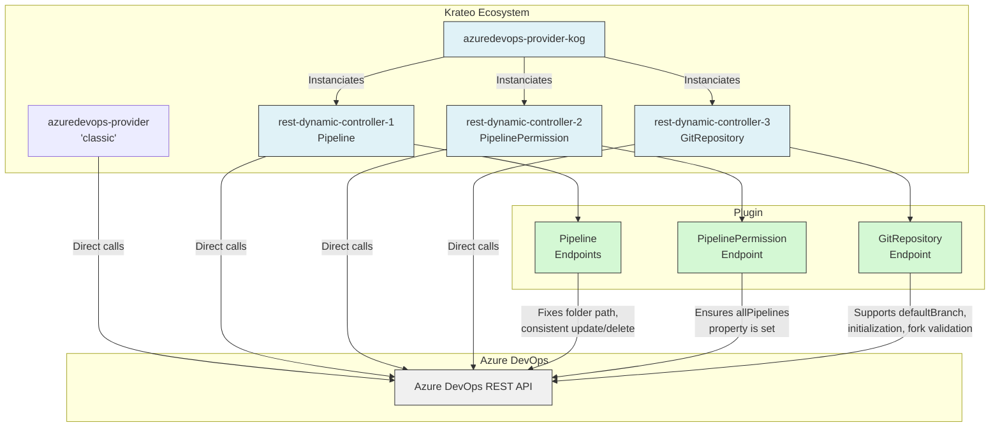

# Krateo Azure DevOps Provider KOG

This is a [Helm Chart](https://helm.sh/docs/topics/charts/) that deploys the Krateo Azure DevOps Provider KOG leveraging the [Krateo OASGen Provider](https://github.com/krateoplatformops/oasgen-provider).
This provider allows you to manage [Azure DevOps resources](https://azure.microsoft.com/en-us/products/devops) such as `gitrepositories`, `pipelines`, and `pipelinepermissions` using the Krateo platform.

> [!NOTE]  
> This chart is still in development and not yet ready for production use.

## Summary

- [Summary](#summary)
- [Architecture](#architecture)
- [Requirements](#requirements)
- [How to install](#how-to-install)
- [Use in parallel with Azure DevOps Provider (classic)](#use-in-parallel-with-azure-devops-provider-classic)
  - [Lookup function example](#lookup-function-example)
- [Supported resources](#supported-resources)
  - [Pipeline](#pipeline)
    - [Pipeline operations](#pipeline-operations)
    - [Pipeline schema](#pipeline-schema)
    - [Pipeline example CR](#pipeline-example-cr)
  - [PipelinePermission](#pipelinepermission)
    - [PipelinePermission operations](#pipelinepermission-operations)
    - [PipelinePermission schema](#pipelinepermission-schema)
    - [PipelinePermission example CR](#pipelinepermission-example-cr)
    - [How to revoke permissions](#how-to-revoke-permissions)
  - [GitRepository](#gitrepository)
    - [GitRepository operations](#gitrepository-operations)
    - [GitRepository schema](#gitrepository-schema)
    - [GitRepository example CR](#gitrepository-example-cr)
    - [Fork-related fields](#fork-related-fields)
- [Authentication](#authentication)
- [Configuration](#configuration)
  - [values.yaml](#valuesyaml)
  - [Verbose logging](#verbose-logging)
- [Chart structure](#chart-structure)
- [Troubleshooting](#troubleshooting)

## Architecture

The diagram below illustrates the high-level architecture of the Krateo Azure DevOps Provider KOG and how it interacts with the Azure DevOps REST API.



## Requirements

[Krateo OASGen Provider](https://github.com/krateoplatformops/oasgen-provider) should be installed in your cluster. 
Follow the related Helm Chart [README](https://github.com/krateoplatformops/oasgen-provider-chart) for installation instructions.

## How to install

To install the chart, use the following commands:

```sh
helm repo add krateo https://charts.krateo.io
helm repo update krateo
helm install azuredevops-provider-kog krateo/azuredevops-provider-kog
```

> [!NOTE]
> Due to the nature of the providers leveraging the [Krateo OASGen Provider](https://github.com/krateoplatformops/oasgen-provider), this chart will install a set of RestDefinitions that will in turn trigger the deployment of a number of controllers in the cluster. These controllers need to be up and running before you can create or manage resources using the Custom Resources (CRs) defined by this provider. This may take a few minutes after the chart is installed.

You can check the status of the controllers by running the following commands:
```sh
until kubectl get deployment azuredevops-provider-kog-<RESOURCE>-controller -n <YOUR_NAMESPACE> &>/dev/null; do
  echo "Waiting for <RESOURCE> controller deployment to be created..."
  sleep 5
done
kubectl wait deployments azuredevops-provider-kog-<RESOURCE>-controller --for condition=Available=True --namespace <YOUR_NAMESPACE> --timeout=300s
```

Make sure to replace `<RESOURCE>` to one of the resources supported by the chart, such as `pipelinepermission`, `pipeline`, `gitrepository`, and `<YOUR_NAMESPACE>` with the namespace where you installed the chart.

## Use "in parallel" with Krateo Azure DevOps Provider (classic)

This chart can be used in parallel with the [Krateo Azure DevOps Provider (classic)](https://github.com/krateoplatformops/azuredevops-provider).
As a matter of fact, currently, this chart allows you to manage the following resources:
- `GitRepository`
- `Pipeline`
- `PipelinePermission`

Other resources (`TeamProject`, `Queue`, `Environment`, etc.) can be managed using the [Krateo Azure DevOps Provider (classic)](https://github.com/krateoplatformops/azuredevops-provider) and referenced by the resources managed by this chart.
For example, you can create a `PipelinePermission` resource that references an `Environment` resource created by the Azure DevOps Provider (classic).
> [!NOTE]  
> These references are "by id" or other Azure DevOps resource identifiers but not Kubernetes-native. Meaning that the `PipelinePermission` resource will reference the `Environment` by its `id`, not by a Kubernetes resource name and namespace. Said `id` can be found in the `status` field of the `Environment` resource created by the Azure DevOps Provider (classic). An example on how to reference resource in this way is available in the [Lookup function example](#lookup-function-example) section below.

Therefore the overall scenario is the following:
- You should use the Krateo Azure DevOps Provider (classic) to manage resources that are not supported by this chart, such as `TeamProject`, `Queue`, `Environment`, etc.
- You should use the Krateo Azure DevOps Provider KOG (this chart) to manage only resources that are supported: `GitRepository`, `Pipeline`, and `PipelinePermission`.

Note that the following resources: 
- `GitRepository`
- `Pipeline`
- `PipelinePermission` 

are supported by both the Krateo Azure DevOps Provider (classic) and the Krateo Azure DevOps Provider KOG and a migration guide is available in the [Migration guide](./docs/migration_guide.md) section of the `/docs` folder of this chart.
The migration guide explains how to migrate from the Krateo Azure DevOps Provider (classic) resources to the Krateo Azure DevOps Provider KOG resources.

### Lookup function example

// TODO

## Supported resources

This chart supports the following resources and operations:

| Resource           | Get  | Create | Update | Delete |
|--------------------|------|--------|--------|--------|
| GitRepository      | ✅   | ✅     | ✅     | ✅     |
| Pipeline           | ✅   | ✅     | ✅     | ✅     |
| PipelinePermission | ✅   | ✅     | 🟡     | 🚫 Not supported    |

> [!NOTE]  
> 🚫 *"Not supported"* means that the operation is not supported by the resource (e.g., the underlying REST API does not support it and therefore the controller does not implement it) while 🚫 *"Not applicable"* means that the operation does not apply to the resource.

> [!NOTE]  
> 🟡 *"Partial"* means that the operation is only partially supported — for example, only some fields are implemented.

The resources listed above are Custom Resources (CRs) defined in the `azuredevops.kog.krateo.io` API group. They are used to manage Azure DevOps resources in a Kubernetes-native way, allowing you to create, update, and delete Azure DevOps resources using Kubernetes manifests.

You can find example resources for each supported resource type in the `/samples` folder of the chart.
These examples Custom Resources (CRs) show every possible field that can be set in the resource based reflected on the Custom Resource Definitions (CRDs) that are generated and installed in the cluster.

### Pipeline

The `Pipeline` resource is used to manage Azure DevOps pipelines.

#### Pipeline operations

- **Create**: You can create a `Pipeline` resource to create a new pipeline in Azure DevOps. You can specify the name, project, organization, and the fields related to the pipeline configuration, such as the repository and path.
- **Update**: You can update the name and configuration of an existing pipeline.
- **Delete**: You can delete an existing pipeline. This will remove the pipeline from Azure DevOps.

#### Pipeline schema

The `Pipeline` resource schema includes the following fields:

// TODO


#### Pipeline example CR

An example of a `Pipeline` resource is:
```yaml
apiVersion: azuredevops.kog.krateo.io/v1alpha1
kind: Pipeline
metadata:
  name: test-pipeline-kog-1
  namespace: adp
  annotations:
    krateo.io/connector-verbose: "true"
spec:
  authenticationRefs:
    basicAuthRef: azure-devops-basic-auth 
  
  api-version: "7.2-preview.1"                    # Version of the API to use
  organization: krateo-kog                        # Name of the Azure DevOps organization
  project: "test-project-1-classic"
  
  configuration:
    path: azure-pipelines.yml                      # Path to the pipeline configuration file within the repository
    repository: 
      id: "58877fa0-7bd2-4f23-959a-7e276d0ee87c"   # ID of the repository where the pipeline is defined
      type: azureReposGit                          # Type of the repository, e.g., gitHub, azureReposGit, etc.
    type: yaml                                     # Type of the pipeline configuration, e.g., yaml, designer, etc.

  name: test-pipeline-kog-1                        # Name of the pipeline
```

### PipelinePermission

The `PipelinePermission` resource is used to manage permissions for Azure DevOps pipelines.

#### PipelinePermission operations

- **Create**: You can create a `PipelinePermission` resource to grant permissions for specific pipelines to use a specific resource, such as `environment`, `queue`, etc.
- **Update**: Updating is only partially supported, meaning that you cannot directly revoke permissions (change the `authorized` field to `false`) for existing pipelines (see the [section below](#how-to-revoke-permissions) on how to revoke permissions for pipelines). You can only add new pipelines with `authorized: true`. You can also change permissions for all pipelines in the project by setting the `allPipelines` field to `authorized: true` or `authorized: false`.
- **Delete**: Deleting a `PipelinePermission` custom resource will not revoke permissions for the pipelines, it will only remove the resource from the cluster and the controller will stop managing it. The Azure DevOps pipelines will still have the permissions granted by the `PipelinePermission` resource until you manually revoke them in the Azure DevOps UI.

#### PipelinePermission schema

The `PipelinePermission` resource schema includes the following fields:

// TODO

#### PipelinePermission example CR

An example of a `PipelinePermission` resource is:
```yaml
apiVersion: azuredevops.kog.krateo.io/v1alpha1
kind: PipelinePermission
metadata:
  name: test-pp
  namespace: adp
  annotations:
    krateo.io/connector-verbose: "true"
spec:
  authenticationRefs:
    basicAuthRef: azure-devops-basic-auth
  api-version: 7.2-preview.1
  
  organization: "krateo-kog"
  project: "test-project-1-classic"
  resourceType: "environment" 
  resourceId: "7"

  allPipelines:
    authorized: false

  pipelines:
    - id: 14
      # authorized: true is not required, since it is the default value (authorized: false is not allowed)
    - id: 15
```

#### How to revoke permissions

To revoke permissions for a pipeline, you need to:
1. Manually remove the specific `Pipeline` in the Azure DevOps UI under the `Pipeline permission` section of the resource you want to manage (e.g., `Environment`, `Queue`, etc.).
2. Update the `PipelinePermission` resource on Kubernetes by removing the specific pipeline `id` from the `pipelines` array in the `PipelinePermission` resource. 

### GitRepository

The `GitRepository` resource is used to manage Azure DevOps GitRepositories.

#### GitRepository operations
- **Create**: You can create a new GitRepository in Azure DevOps. You can specify the name, project and organization, and other optional fields such as default branch, and whether the repository should be a fork of another repository.
- **Update**: You can update the name and default branch of an existing GitRepository. Note that you cannot change the project or organization of an existing repository.
- **Delete**: You can delete an existing GitRepository. This will remove the repository from Azure DevOps.

#### GitRepository schema

// TODO

#### GitRepository example CR

An example of a `GitRepository` resource is:
```yaml
apiVersion: azuredevops.kog.krateo.io/v1alpha1
kind: GitRepository
metadata:
  name: test-gitrepository-kog
  namespace: adp
  annotations:
    krateo.io/connector-verbose: "true"
spec:
  authenticationRefs:
    basicAuthRef: azure-devops-basic-auth         # Reference to a CR containing the basic authentication information.
  api-version: "7.2-preview.2"                    # Version of the API to use

  organization: "krateo-kog"                      # name of the Azure DevOps organization
  projectId: "test-project-1-classic"             # ID or name of the project

  name: "test-gitrepository-kog-v4"               # Name of the repository to create or manage  
  defaultBranch: "refs/heads/test-branch"         # Default branch for the repository, can be omitted if you want to use the default branch set by Azure DevOps or the default branch of the parent repository if you are forking a repository. 
  #Note that if you specify a default branch, the repository must be initialized with a first commit (and therefore `initialize` must be set to `true`), otherwise the repository will not be created successfully.
  initialize: true                                # Whether to initialize the repository with a first commit. If set to true, the repository will be initialized with a first commit.

  # Fork-related fields: these fields are needed only if the repository to be created is a fork of another repository
  # These fields should be omitted if you want to create a new repository instead of forking an existing one.
  project: 
    id: 11790bc5-82bd-4cdc-b6a6-47bcb7187051      # ID of the project where the repository will be created
  parentRepository:
    id: "58877fa0-7bd2-4f23-959a-7e276d0ee87c"    # ID of the parent repository to fork
    project:
      id: "11790bc5-82bd-4cdc-b6a6-47bcb7187051"  # ID of the parent repository's project

  #sourceRef: "refs/heads/test-branch"
  # omitting sourceRef will copy all branches from parent 
  # assignin a non-existing branch to sourceRef will result in an error

```

#### Fork-related fields

You can learn more about the fork-related fields in the [Azure DevOps documentation](https://learn.microsoft.com/en-us/rest/api/azure/devops/git/repositories/create#create-a-fork-of-a-parent-repository).

## Authentication

The authentication to the Azure DevOps REST API is managed using 2 resources (both are required):

- **Kubernetes Secret**: This resource is used to store the Azure DevOps Personal Access Token (PAT) that is used to authenticate with the Azure DevOps REST API. The PAT should have the necessary permissions to manage the resources you want to create, update or delete.

In order to generate a Azure DevOps token you could follow the steps described in the [Azure DevOps documentation](https://learn.microsoft.com/en-us/azure/devops/organizations/accounts/use-personal-access-tokens-to-authenticate).

Example of a Kubernetes Secret that you can apply to your cluster:
```sh
kubectl apply -f - <<EOF
apiVersion: v1
kind: Secret
metadata:
  name: azuredevops-secret
  namespace: default # Or your desired namespace
type: Opaque
stringData:
  token: <PAT>
EOF
```

Replace `<PAT>` with your actual Azure DevOps Personal Access Token.

- **BasicAuth**: This resource references the Kubernetes Secret and is used to authenticate with the Azure DevOps REST API. Then, it is used in the `authenticationRefs` field of the Custom Resources (like `PipelinePermission`, `Pipeline`, and `GitRepository`) defined in this chart.

Example of a BasicAuth resource that references the Kubernetes Secret, to be applied to your cluster:
```sh
kubectl apply -f - <<EOF
apiVersion: azuredevops.kog.krateo.io/v1alpha1
kind: BasicAuth
metadata:
  name: azure-devops-basic-auth
  namespace: adp                  # Replace with your namespace
spec:
  username: "anything"            # Any value as official Azure DevOps OAS suggests (field not used)
  passwordRef:
    name: azuredevops-secret
    namespace: default            # Or your desired namespace
    key: token
EOF
```

Note that the namespace in the `metadata` section of the `BasicAuth` resource should match the namespace where the resources managed by this chart will be created (e.g., `adp` in the example above).

## Configuration

### values.yaml

You can customize the chart by modifying the `values.yaml` file.
For instance, you can select which resources the provider should support in the oncoming installation by setting the `restdefinitions` field in the `values.yaml` file. 
This may be useful if you want to limit the resources managed by the provider to only those you need, reducing the overhead of managing unnecessary controllers.
The default configuration enables all resources supported by the chart.

### Verbose logging

In order to enable verbose logging for the controllers, you can add the `krateo.io/connector-verbose: "true"` annotation to the metadata of the resources you want to manage, as shown in the examples above. 
This will enable verbose logging for those specific resources, which can be useful for debugging and troubleshooting as it will provide more detailed information about the operations performed by the controllers.

## Chart structure

Main components of the chart:

- **RestDefinitions**: These are the core resources needed to manage resources leveraging the Krateo OASGen Provider. In this case, they refers to the OpenAPI Specification to be used for the creation of the Custom Resources (CRs) that represent Azure DevOps resources.
They also define the operations that can be performed on those resources. Once the chart is installed, RestDefinitions will be created and as a result, specific controllers will be deployed in the cluster to manage the resources defined with those RestDefinitions.

- **ConfigMaps**: Refer directly to the OpenAPI Specification content in the `/assets` folder.

- **/assets** folder: Contains the selected OpenAPI Specification files for the Azure DevOps REST API.

- **/samples** folder: Contains example resources for each supported resource type as seen in this README. These examples demonstrate how to create and manage Azure DevOps resources using the Krateo Azure DevOps Provider KOG.

- **Deployment**: Deploys a [plugin](https://github.com/krateoplatformops/azuredevops-rest-dynamic-controller-plugin) that is used as a proxy to resolve some inconsistencies of the Azure DevOps REST API. The specific endpoins managed by the plugin are described in the [plugin README](https://github.com/krateoplatformops/azuredevops-rest-dynamic-controller-plugin/blob/main/README.md)

- **Service**: Exposes the plugin described above, allowing the resource controllers to communicate with the Azure DevOps REST API through the plugin, only if needed.

## API references

- [Azure DevOps REST API](https://learn.microsoft.com/en-us/rest/api/azure/devops/)
- [Azure DevOps REST API specification](https://github.com/MicrosoftDocs/vsts-rest-api-specs)

A document which describe the changes made to the OpenAPI Specification (OAS) of the resources managed by the Azure DevOps Provider KOG is available in the [OAS changes](./docs/OAS_changes.md) section of the `/docs` folder of this chart.

## Troubleshooting

For troubleshooting, you can refer to the [Troubleshooting guide](./docs/troubleshooting.md) in the `/docs` folder of this chart. 
It contains common issues and solutions related to this chart.
