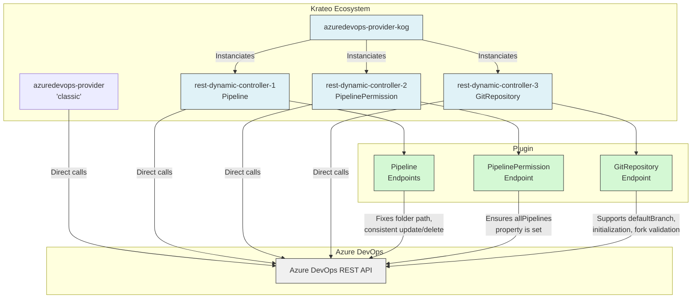

# Krateo Azure DevOps Provider KOG

***KOG***: (*Krateo Operator Generator*)

This is a [Helm Chart](https://helm.sh/docs/topics/charts/) that deploys the Krateo Azure DevOps Provider KOG leveraging the [Krateo OASGen Provider](https://github.com/krateoplatformops/oasgen-provider).
This provider allows you to manage [Azure DevOps resources](https://azure.microsoft.com/en-us/products/devops) such as `gitrepositories`, `pipelines`, and `pipelinepermissions` using the Krateo platform.

## Summary

- [Architecture](#architecture)
- [Requirements](#requirements)
- [How to install](#how-to-install)
- [Use in parallel with Krateo Azure DevOps Provider (classic)](#use-in-parallel-with-krateo-azure-devops-provider-classic)
  - [One-way retro-compatibility](#one-way-retro-compatibility)
  - [Helm Lookup functions example](#helm-lookup-functions-example)
- [Supported resources](#supported-resources)
  - [GitRepository](#gitrepository)
    - [GitRepository operations](#gitrepository-operations)
    - [GitRepository schema](#gitrepository-schema)
    - [GitRepository example CR](#gitrepository-example-cr)
    - [Fork-related fields](#fork-related-fields)
  - [Pipeline](#pipeline)
    - [Pipeline operations](#pipeline-operations)
    - [Pipeline schema](#pipeline-schema)
    - [Pipeline example CR](#pipeline-example-cr)
  - [PipelinePermission](#pipelinepermission)
    - [PipelinePermission operations](#pipelinepermission-operations)
    - [PipelinePermission schema](#pipelinepermission-schema)
    - [PipelinePermission example CR](#pipelinepermission-example-cr)
    - [How to revoke permissions](#how-to-revoke-permissions)
- [Authentication](#authentication)
- [Configuration](#configuration)
  - [Configuration resources](#configuration-resources)
  - [values.yaml](#valuesyaml)
  - [Verbose logging](#verbose-logging)
- [Chart structure](#chart-structure)
- [Troubleshooting](#troubleshooting)

## Architecture

The diagram below illustrates the high-level architecture of the Krateo Azure DevOps Provider KOG and how it interacts with the Azure DevOps REST API.



## Requirements

[Krateo OASGen Provider](https://github.com/krateoplatformops/oasgen-provider) (0.6.0+) should be installed in your cluster. 
Follow the related Helm Chart [README](https://github.com/krateoplatformops/oasgen-provider-chart) for installation instructions.

## How to install

To install the chart, use the following commands:

```sh
helm repo add krateo https://charts.krateo.io
helm repo update krateo
helm install azuredevops-provider-kog krateo/azuredevops-provider-kog
```

> [!NOTE]
> Due to the nature of the providers leveraging the [Krateo OASGen Provider](https://github.com/krateoplatformops/oasgen-provider), this chart will install a set of RestDefinitions that will in turn trigger the deployment of a number of controllers in the cluster. These controllers need to be up and running before you can create or manage resources using the Custom Resources (CRs) defined by this provider. This may take a few minutes after the chart is installed.

You can check the status of the RestDefinitions with the following commands:

```sh
kubectl get restdefinitions.ogen.krateo.io --all-namespaces | awk 'NR==1 || /azuredevops/'
```

You should see output similar to this:
```sh
NAMESPACE       NAME                                      READY   AGE
krateo-system   azuredevops-provider-gitrepository        True    108s
krateo-system   azuredevops-provider-pipeline             True    108s
krateo-system   azuredevops-provider-pipelinepermission   True    108s
```

You can also wait for a specific RestDefinition to be ready with a command like this:
```sh
kubectl wait restdefinitions.ogen.krateo.io azuredevops-provider-gitrepository --for condition=Ready=True --namespace krateo-system --timeout=300s
```

Note that the names of the RestDefinitions and the namespace where the RestDefinitions are installed may vary based on your configuration.

## Use "in parallel" with Krateo Azure DevOps Provider (classic)

This chart can be used in parallel with the [Krateo Azure DevOps Provider (classic)](https://github.com/krateoplatformops/azuredevops-provider).
As a matter of fact, currently, this chart allows you to manage the following resources:
- `GitRepository`
- `Pipeline`
- `PipelinePermission`

Other resources (`TeamProject`, `Queue`, `Environment`, etc.) can be managed using the [Krateo Azure DevOps Provider (classic)](https://github.com/krateoplatformops/azuredevops-provider) and referenced by the resources managed by this chart.
For example, you can create a `PipelinePermission` resource that references an `Environment` resource created by the Azure DevOps Provider (classic).
> [!NOTE]  
> These references are "by id" or other Azure DevOps resource identifiers but not Kubernetes-native. Meaning that the `PipelinePermission` resource will reference the `Environment` by its `id`, not by a Kubernetes resource name and namespace. Said `id` can be found in the `status` field of the `Environment` resource created by the Krateo Azure DevOps Provider (classic). An example on how to reference resource in this way is available in the [Lookup functions example](#lookup-functions-example) section below.

Therefore the overall scenario is the following:
- You should use the Krateo Azure DevOps Provider (classic) to manage resources that are not supported by this chart, such as `TeamProject`, `Queue`, `Environment`, etc.
- You should use the Krateo Azure DevOps Provider KOG (this chart) to manage only resources that are supported: `GitRepository`, `Pipeline`, and `PipelinePermission`.

Note that the following resources: 
- `GitRepository`
- `Pipeline`
- `PipelinePermission` 

are supported by both the Krateo Azure DevOps Provider (classic) and the Krateo Azure DevOps Provider KOG and a migration guide is available in the [Migration guide](./docs/migration_guide.md) section of the `/docs` folder of this chart.
The migration guide explains how to migrate from the Krateo Azure DevOps Provider (classic) resources to the Krateo Azure DevOps Provider KOG resources (for what concerns `GitRepository`, `Pipeline`, and `PipelinePermission`).

### One-way retro-compatibility

The Krateo Azure DevOps Provider KOG (this chart) resources can reference resources created by the Krateo Azure DevOps Provider (classic) but not vice-versa.

For instance, a `PipelinePermission` resource created by this chart can reference an `Environment` resource created by the Krateo Azure DevOps Provider (classic) but a `PipelinePermission` resource created by the Krateo Azure DevOps Provider (classic) cannot reference a `Pipeline` resource created by this chart.

This is due to the fact that the Krateo Azure DevOps Provider (classic) uses Kubernetes references (name and namespace) to reference other resources, while the Krateo Azure DevOps Provider KOG (this chart) uses Azure DevOps resource identifiers (e.g., `id`) to reference other resources.
If you try to reference a resource created by this chart in a resource created by the Krateo Azure DevOps Provider (classic), the controller of the Krateo Azure DevOps Provider (classic) will not be able to find the referenced resource due to the different API group and version used by the Krateo Azure DevOps Provider KOG (this chart).

### Helm Lookup functions example

An example of how to use the Helm `lookup` function to retrieve the project ID, environment ID and pipeline ID dynamically is shown below, in the context of the `PipelinePermission` resource.
In this case the context is a Helm chart, so the `lookup` function is used to retrieve the `TeamProject`, `Environment` and `Pipeline` resources by their names and namespace, and then the project ID, environment ID, and pipeline ID are accessed from the status of those resources.

```yaml
{{- $project := lookup "azuredevops.krateo.io/v1alpha1" "TeamProject" .Release.Namespace (.Values.project.name | lower) }}
{{- if and $project $project.status $project.status.id }}

{{- $environment := lookup "azuredevops.krateo.io/v1alpha1" "Environment" .Release.Namespace (.Values.environment.name | lower) }}
{{- if and $environment $environment.status $environment.status.id }}

{{- $pipeline := lookup "azuredevops.krateo.io/v1alpha1" "Pipeline" .Release.Namespace (.Values.pipeline.name | lower) }}
{{- if and $pipeline $pipeline.status $pipeline.status.id }}

apiVersion: azuredevops.ogen.krateo.io/v1alpha1
kind: PipelinePermission
spec:
  project: "{{ $project.status.id }}"         # Dynamically retrieve the project ID

  resourceType: "environment"                 # Type of the resource
  resourceId: "{{ $environment.status.id }}"  # Dynamically retrieve the environment ID

  pipelines:
    - id: "{{ $pipeline.status.id }}"         # Dynamically retrieve the pipeline ID  
...

{{- end }}
```

Note that in this example, we used a "short-circuit nil guard" / incremental nil-check chain to ensure that the resources exist and have a `status` field with an `id` before trying to access it. 
For example, `{{- if and $project $project.status $project.status.id }}` checks that `$project` is not nil, that it has a `status` field, and that the `status` field has an `id` field.
Otherwise the template would fail with a nil pointer dereference error if any of the resources do not exist or do not have the expected fields.

## Supported resources

This chart supports the following resources and operations:

| Resource           | Get  | Create | Update | Delete |
|--------------------|------|--------|--------|--------|
| GitRepository      | ✅   | ✅     | ✅     | ✅     |
| Pipeline           | ✅   | ✅     | ✅     | ✅     |
| PipelinePermission | ✅   | ✅     | 🟡     | 🚫 Not supported    |

> [!NOTE]  
> 🚫 *"Not supported"* means that the operation is not supported by the resource (e.g., the underlying REST API does not support it and therefore the controller does not implement it) while 🚫 *"Not applicable"* means that the operation does not apply to the resource.

> [!NOTE]  
> 🟡 *"Partial"* means that the operation is only partially supported — for example, only some fields are implemented.

The resources listed above are Custom Resources (CRs) defined in the `azuredevops.ogen.krateo.io` API group. They are used to manage Azure DevOps resources in a Kubernetes-native way, allowing you to create, update, and delete Azure DevOps resources using Kubernetes manifests.

You can find example resources for each supported resource type in the `/samples` folder of the chart.

### GitRepository

The `GitRepository` resource is used to manage Azure DevOps GitRepositories.

#### GitRepository operations
- **Create**: You can create a new GitRepository in Azure DevOps. You can specify the name, project and organization, and other optional fields such as default branch, and whether the repository should be a fork of another repository.
- **Update**: You can update the name and default branch of an existing GitRepository. Note that you cannot change the project or organization of an existing repository.
- **Delete**: You can delete an existing GitRepository. This will remove the repository from Azure DevOps.

#### GitRepository schema

The `GitRepository` resource schema includes the following fields:

| Field | Type | Description | Notes |
| :--- | :--- | :--- | :--- |
| `configurationRef.name` | `string` | Name of the GitRepositoryConfiguration resource to use. |
| `configurationRef.namespace` | `string` | Namespace of the GitRepositoryConfiguration resource to use. |
| `organization` | `string` | The name of the Azure DevOps organization. |
| `projectId` | `string` | The ID or name of the project. |
| `name` | `string` | The name of the repository to create or manage. |
| `defaultBranch` | `string` | The default branch for the repository (e.g., `refs/heads/main`). |
| `initialize` | `boolean` | If `true`, initializes the repository with a first commit (with README file) | Ignored when forking a repository. |
| `parentRepository.id` | `string` | ID of the parent repository to fork. | Needed only when forking a repository. |
| `parentRepository.project.id` | `string` | ID of the parent repository's project. | Needed only when forking a repository. |
| `project.id` | `string` | ID of the project where the forked repository will be created (same project as `projectId`). | Needed only when forking a repository. |
| `sourceRef` | `string` | The source ref to use when creating a fork. Omitting it copies all branches. | Needed only when forking a repository. |

#### GitRepository example CR

An example of a `GitRepository` resource is:
```yaml
apiVersion: azuredevops.ogen.krateo.io/v1alpha1
kind: GitRepository
metadata:
  name: test-gitrepository-kog
  namespace: default
  annotations:
    krateo.io/connector-verbose: "true"
spec:
  configurationRef:                               # Reference to a GitRepositoryConfiguration CR that contains the authentication information.
    name: my-gitrepository-config
    namespace: default

  organization: "krateo-kog"                      # name of the Azure DevOps organization
  projectId: "project-1-classic"                  # ID or name of the project

  name: "test-gitrepository-kog"                  # Name of the repository to create or manage  
  defaultBranch: "refs/heads/test-branch"         # Default branch for the repository, can be omitted if you want to use the default branch set by Azure DevOps or the default branch of the parent repository if you are forking a repository. 
  # Note that if you specify a default branch in a non-forked repository, the repository must be initialized with a first commit (and therefore `initialize` must be set to `true`), otherwise the repository will not be created successfully.
  # When forking a repository, `initialize` is ignored.
  initialize: true                                # Whether to initialize the repository with a first commit. If set to true, the repository will be initialized with a first commit.

  # Fork-related fields: these fields are needed only if the repository to be created is a fork of another repository
  # These fields should be omitted if you want to create a new repository instead of forking an existing one.
  project: 
    id: 99837031-4e4e-4753-9a47-73fcc4cba766      # ID of the project where the repository will be created (id of the project set in 'projectId' above)
  parentRepository:
    id: "5605b0ba-e2fa-4aab-af0b-0888321b3a08"    # ID of the parent repository to fork
    project:
      id: "99837031-4e4e-4753-9a47-73fcc4cba766"  # ID of the parent repository's project

  #sourceRef: "refs/heads/test-branch"
  # omitting sourceRef will copy all branches from parent 
  # assigning a non-existing branch to sourceRef will result in an error
```

#### Fork-related fields

You can learn more about the fork-related fields in the [Azure DevOps documentation](https://learn.microsoft.com/en-us/rest/api/azure/devops/git/repositories/create#create-a-fork-of-a-parent-repository).

### Pipeline

The `Pipeline` resource is used to manage Azure DevOps pipelines.

#### Pipeline operations

- **Create**: You can create a `Pipeline` resource to create a new pipeline in Azure DevOps. You can specify the name, project, organization, and the fields related to the pipeline configuration, such as the repository and path.
- **Update**: You can update the name and configuration of an existing pipeline.
- **Delete**: You can delete an existing pipeline. This will remove the pipeline from Azure DevOps.

#### Pipeline schema

The `Pipeline` resource schema includes the following fields:

| Field | Type | Description |
| :--- | :--- | :--- |
| `configurationRef.name` | `string` | Name of the PipelineConfiguration resource to use. |
| `configurationRef.namespace` | `string` | Namespace of the PipelineConfiguration resource to use. |
| `organization` | `string` | The name of the Azure DevOps organization. |
| `project` | `string` | The name or ID of the project. |
| `name` | `string` | The name of the pipeline. |
| `configuration.path` | `string` | Path to the pipeline configuration file within the repository. |
| `configuration.repository.id` | `string` | ID of the repository where the pipeline is defined. |
| `configuration.repository.type` | `string` | Type of the repository (e.g., `azureReposGit`). |
| `configuration.type` | `string` | Type of the pipeline configuration (e.g., `yaml`). |


#### Pipeline example CR

An example of a `Pipeline` resource is:
```yaml
apiVersion: azuredevops.ogen.krateo.io/v1alpha1
kind: Pipeline
metadata:
  name: test-pipeline-kog-1
  namespace: default
  annotations:
    krateo.io/connector-verbose: "true"
spec:
  configurationRef:                               # Reference to a PipelineConfiguration CR that contains the authentication information.
    name: my-pipeline-config
    namespace: default

  organization: krateo-kog                        # Name of the Azure DevOps organization
  project: "project-1-classic"
  
  configuration:
    path: azure-pipelines.yml                      # Path to the pipeline configuration file within the repository
    repository: 
      id: "9960f2d2-cfdf-4dfe-a314-e956b8d8d41f"   # ID of the repository where the pipeline configuration is defined
      type: azureReposGit                          # Type of the repository, e.g., gitHub, azureReposGit, etc.
    type: yaml                                     # Type of the pipeline configuration, e.g., yaml, designer, etc.

  name: test-pipeline-kog-1                        # Name of the pipeline
```

### PipelinePermission

The `PipelinePermission` resource is used to manage permissions for Azure DevOps pipelines to access resources.

Examples of protected resources include:
- Agent pools
- Secret variables in variable groups
- Secure files
- Service connections
- Environments
- Repositories

Reference to the official [Azure DevOps REST API documentation](https://learn.microsoft.com/en-us/azure/devops/pipelines/security/resources?view=azure-devops) for more details on pipeline permissions and how they work.

#### PipelinePermission operations

- **Create**: You can create a `PipelinePermission` resource to grant permissions for specific pipelines to use a specific resource, such as `environment`, `queue`, etc.
- **Update**: Updating is only partially supported, meaning that you cannot directly revoke permissions (change the `authorized` field to `false`) for existing authorized pipelines (see the [section below](#how-to-revoke-permissions) on how to revoke permissions for pipelines). You can only add new authorized pipelines in the `pipelines` array. You can also change permissions for all pipelines in the project by setting the `allPipelines` field to `authorized: true` or `authorized: false`.
- **Delete**: Deleting a `PipelinePermission` resource on the Kubernetes cluster will not revoke permissions for the pipelines on Azure DevOps, it will only remove the resource from the cluster and the controller will stop managing it. The Azure DevOps pipelines will still have the permissions granted by the `PipelinePermission` resource until you manually revoke them in the Azure DevOps UI (see the [section below](#how-to-revoke-permissions) on how to revoke permissions for pipelines).
The choice is driven by the fact that Azure DevOps REST API allows to retrieve only the pipelines that are authorized, therefore the management of both authorized and unauthorized pipelines is not possible.

#### PipelinePermission schema

The `PipelinePermission` resource schema includes the following fields:

| Field | Type | Description |
| :--- | :--- | :--- |
| `configurationRef.name` | `string` | Name of the PipelineConfiguration resource to use. |
| `configurationRef.namespace` | `string` | Namespace of the PipelineConfiguration resource to use. |
| `organization` | `string` | The name of the Azure DevOps organization. |
| `project` | `string` | The name or ID of the project. |
| `resourceType` | `string` | The type of resource to authorize (e.g., `repository`, `environment`, `queue`, `teamproject`, `endpoint`, `variablegroup`, `securefile`). |
| `resourceId` | `string` | The ID of the resource to authorize. |
| `allPipelines.authorized` | `boolean` | Set to `true` to authorize all pipelines, `false` to specify permissions individually. |
| `pipelines` | `array` | A list of pipeline objects to authorize. |
| `pipelines.id` | `integer` | The ID of the pipeline to grant permission to. |
| `pipelines.authorized` | `boolean` | Set to `true` to grant permission. Defaults to `true` (so you don't need to specify it explicitly in the CR). Setting to `false` is not allowed. |

Note: in the case of managing a `PipelinePermission` for an Agent Pool, the `resourceType` should be set to `queue`.

Note: if you set `allPipelines.authorized` to `true`, and also specify individual pipelines in the `pipelines` array, there will be the following behavior:
- All pipelines in the project will be authorized to use the resource.
- If you manually remove the newly added permission named "No restrictions - Any pipeline may use this resource" in the Azure DevOps UI, then only the pipelines specified in the `pipelines` array will remain authorized.

An example of a `PipelinePermission` resource is:
```yaml
apiVersion: azuredevops.ogen.krateo.io/v1alpha1
kind: PipelinePermission
metadata:
  name: test-pipelinepermission-kog-environment
  namespace: default
  annotations:
    krateo.io/connector-verbose: "true"
spec:
  configurationRef:                     # Reference to a PipelinePermissionConfiguration CR that contains the authentication information.
    name: my-pipelinepermission-config
    namespace: default
  
  organization: "krateo-kog"
  project: "project-1-classic"
  resourceType: "environment" 
  resourceId: "39"

  allPipelines:
    authorized: true

  pipelines:
    - id: 79
      # authorized: true is not required to be set here, since it is already the default value (and `authorized: false` is not allowed)
    - id: 80

```

#### How to revoke permissions

To revoke permissions for a pipeline, you need to:
1. Manually remove the specific `Pipeline` in the Azure DevOps UI under the `Pipeline permission` section of the resource you want to manage (e.g., `Environment`, `Queue`, etc.). Note that the location of the `Pipeline permission` section may vary depending on the type of resource you are managing.
2. Update the `PipelinePermission` resource on Kubernetes by removing the specific pipeline `id` from the `pipelines` array in the `PipelinePermission` resource. 

## Authentication

The authentication to the Azure DevOps REST API is managed using 2 resources (both are required):

- **Kubernetes Secret**: This resource is used to store the Azure DevOps Personal Access Token (PAT) that is used to authenticate with the Azure DevOps REST API. The PAT should have the necessary permissions to manage the resources you want to create, update or delete.

In order to generate a Azure DevOps token you could follow the steps described in the [Azure DevOps documentation](https://learn.microsoft.com/en-us/azure/devops/organizations/accounts/use-personal-access-tokens-to-authenticate).

Example of a Kubernetes Secret that you can apply to your cluster:
```sh
kubectl apply -f - <<EOF
apiVersion: v1
kind: Secret
metadata:
  name: azuredevops-secret
  namespace: default # Or your desired namespace
type: Opaque
stringData:
  token: <PAT>
EOF
```

Replace `<PAT>` with your actual Azure DevOps Personal Access Token.

- **\<Resource\>Configuration**: These resource can reference the Kubernetes Secret and are used to authenticate with the Azure DevOps REST API. They must be referenced with the `configurationRef` field of the resources defined in this chart. The configuration resource can be in a different namespace than the resource itself.

Note that the specific configuration resource type depends on the resource you are managing. For instance, in the case of the `GitRepository` resource, you would need a `GitRepositoryConfiguration`.

An example of a `GitRepositoryConfiguration` resource that references the Kubernetes Secret, to be applied to your cluster:
```sh
kubectl apply -f - <<EOF
apiVersion: azuredevops.ogen.krateo.io/v1alpha1
kind: GitRepositoryConfiguration
metadata:
  name: my-gitrepository-config
  namespace: default
spec:
  authentication:
    basic:
      usernameRef:                  # Any value can be used as username as official Azure DevOps OAS suggests (field not used), but the secret and key must be set.
        name: azuredevops-secret
        namespace: default
        key: token
      passwordRef:
        name: azuredevops-secret
        namespace: default
        key: token
  configuration:
    query:
      create:
        api-version: "7.2-preview.2"
      delete:
        api-version: "7.2-preview.2"
      findby:
        api-version: "7.2-preview.2"
      get:
        api-version: "7.2-preview.2"
      update:
        api-version: "7.2-preview.2"

EOF
```

Then, in the `GitRepository` resource, you can reference the `GitRepositoryConfiguration` resource as follows:
```yaml
apiVersion: azuredevops.ogen.krateo.io/v1alpha1
kind: GitRepository
metadata:
  name: test-gitrepository-kog-1-1
  namespace: default
  annotations:
    krateo.io/connector-verbose: "true"
spec:
  configurationRef:                     # Reference to a GitRepositoryConfiguration CR that contains the authentication information.
    name: my-gitrepository-config
    namespace: default 

  organization: "krateo-kog"             # Name of the Azure DevOps organization
  projectId: "project-1-classic"         # ID or name of the project
  name: "test-gitrepository-kog-1-1"     # Name of the repository to create or manage  
```

More details about the configuration resources in the [Configuration resources](#configuration-resources) section below.

## Configuration

### Configuration resources

Each resource type (e.g., `GitRepository`, `Pipeline`, `PipelinePermission`) requires a specific configuration resource (e.g., `GitRepositoryConfiguration`, `PipelineConfiguration`, `PipelinePermissionConfiguration`) to be created in the cluster.
Currently, the supported configuration resources are:
- `GitRepositoryConfiguration`
- `PipelineConfiguration`
- `PipelinePermissionConfiguration`

These configuration resources are used to store the authentication information (i.e., reference to the Kubernetes Secret containing the Azure DevOps PAT) and other configuration options for the resource type.

You can find examples of these configuration resources in the `/samples/configs` folder of the chart.
Note that in the case of this chart, the **configuration resources are not created automatically** during the installation of the chart, so you need to create them manually before creating any resources that reference them.

Note that a single configuration resource can be used by multiple resources of the same type.
For example, you can create a single `GitRepositoryConfiguration` resource and reference it in multiple `GitRepository` resources.

As examplified in the examples in the folder `/samples/configs`, in the case of this provider, the configuration resources are used to specify the API versions to be used for each operation (create, update, delete, get, findby) for the specific resource type.

### values.yaml

You can customize the chart by modifying the `values.yaml` file.
For instance, you can select which resources the provider should support in the oncoming installation by setting the `restdefinitions` field in the `values.yaml` file. 
This may be useful if you want to limit the resources managed by the provider to only those you need, reducing the overhead of managing unnecessary controllers. For instance, if you only need to manage `GitRepository` resources, you can disable the other resources by setting the `restdefinitions` field as follows:
```yaml
restdefinitions:
  pipelinepermission:
    enabled: false
  gitrepository:
    enabled: true
  pipeline:
    enabled: false
```
The default configuration of the chart enables all resources supported by the chart.

### Verbose logging

In order to enable verbose logging for the controllers, you can add the `krateo.io/connector-verbose: "true"` annotation to the metadata of the resources you want to manage, as shown in the examples above. 
This will enable verbose logging for those specific resources, which can be useful for debugging and troubleshooting as it will provide more detailed information about the operations performed by the controllers.

## Chart structure

Main components of the chart:

- **RestDefinitions**: These are the core resources needed to manage resources leveraging the Krateo OASGen Provider. In this case, they refers to the OpenAPI Specification to be used for the creation of the Custom Resources (CRs) that represent Azure DevOps resources.
They also define the operations that can be performed on those resources. Once the chart is installed, RestDefinitions will be created and as a result, specific controllers will be deployed in the cluster to manage the resources defined with those RestDefinitions.

- **ConfigMaps**: Refer directly to the OpenAPI Specification content in the `/assets` folder.

- **/assets** folder: Contains the selected OpenAPI Specification files for the Azure DevOps REST API.

- **/samples** folder: Contains example resources for each supported resource type as seen in this README. These examples demonstrate how to create and manage Azure DevOps resources using the Krateo Azure DevOps Provider KOG. The folder contains also example of wrong configurations that can be useful for troubleshooting. The latter annotated with comments explaining the errors.

- **Deployment**: Deploys a [plugin](https://github.com/krateoplatformops/azuredevops-rest-dynamic-controller-plugin) that is used as a proxy to resolve some inconsistencies of the Azure DevOps REST API. The specific endpoins managed by the plugin are described in the [plugin README](https://github.com/krateoplatformops/azuredevops-rest-dynamic-controller-plugin/blob/main/README.md)

- **Service**: Exposes the plugin described above, allowing the resource controllers to communicate with the Azure DevOps REST API through the plugin, only if needed.

## API references

- [Azure DevOps REST API](https://learn.microsoft.com/en-us/rest/api/azure/devops/)
- [Azure DevOps REST API specification](https://github.com/MicrosoftDocs/vsts-rest-api-specs)

A document which describe the changes made to the OpenAPI Specification (OAS) of the resources managed by the Krateo Azure DevOps Provider KOG is available in the [OAS changes](./docs/oas_changes_reference.md) section of the `/docs` folder of this chart.

## Troubleshooting

For troubleshooting, you can refer to the [Troubleshooting guide](./docs/troubleshooting_guide.md) in the `/docs` folder of this chart. 
It contains common issues and solutions related to this chart.
